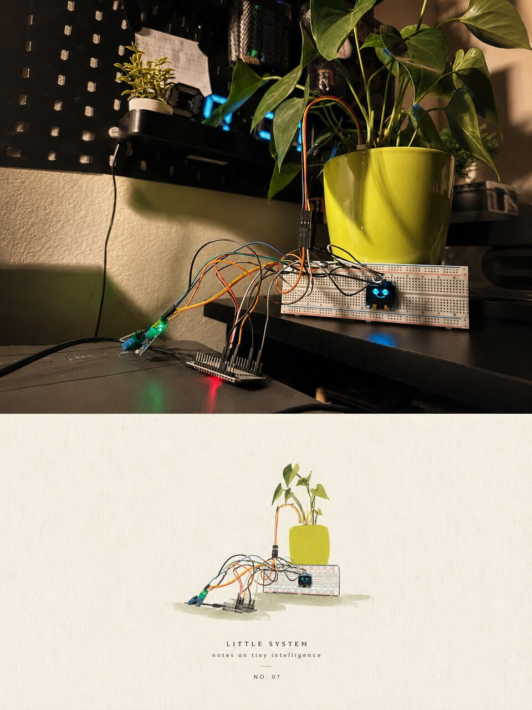

<p align="center">
  
</p>

<h1 align="center">Srećna biljka</h1>

<p align="center">
  ESP32 plant monitor. Reads soil moisture, temperature and light, works out how the
  plant is doing, and sends a push notification when that changes.
</p>

<p align="center">
  
</p>

---

## How it works

The ESP32 reads its sensors every 30 seconds and `POST`s each reading to a Flask REST
API. The API stores the reading, recalculates the plant's state, and if the state changed
since the last one, logs the transition and sends a Web Push notification to every
subscribed browser. An OLED on the device shows the same state as a face, so the plant is
readable without opening anything.

```
ESP32 ──HTTP POST──> Flask API ──> PostgreSQL
  │                      │
  └─ OLED face           └─ Web Push ──> browser / phone
```

## Plant states

The state comes from the latest reading of each sensor type. Priority order: a thirsty
plant outranks an angry one, an angry one outranks a sleepy one.

| State | Condition | Message |
|---|---|---|
| **Žedna** (thirsty) | soil humidity < 30% | needs water |
| **Ljuta** (angry) | temperature > 30 °C, or CO₂ > 1000 ppm | move away from heat / ventilate |
| **Pospana** (sleepy) | light < 500 lux | move somewhere brighter |
| **Srećna** (happy) | everything within range | all good |
| **Spava** (night) | between 19:00 and 09:00 local time | — |

Every state also carries a reason, so the notification says why, not only what.

Between 19:00 and 09:00 the plant is asleep: darkness is expected, so it is not
reported, and only thirst and heat still send a notification. The window and the
timezone come from `NIGHT_FROM`, `NIGHT_TO` and `TIMEZONE`.

## Features

- REST API: CRUD for devices, plus endpoints for readings, plant state and history.
- A push goes out only on an actual state change. `plant_state_log` holds the last known
  state, so a plant that stays thirsty notifies once instead of every 30 seconds.
- Web Push over VAPID. Keys come from `gen_vapid.py`, delivery through `pywebpush`.
- The dashboard is an installable PWA with a manifest and service worker. Charts are
  inline SVG, so there is no charting library to download.
- The OLED renders the state locally and keeps working when the API does not.
- Watering is decided on the device, not by the server: three consecutive thirsty
  readings trigger a 5 second burst, with a half hour cooldown and at most three a
  day. Each run is logged as a reading of the `pump` device. The thirst threshold
  arrives with the state and is remembered, so watering survives an API outage.

## Hardware

| Component | Pin | Notes |
|---|---|---|
| ESP32 dev board | | Wi-Fi + HTTP client |
| Capacitive soil moisture sensor | GPIO 34 | analog, calibrated to % |
| LDR photoresistor | GPIO 35 | analog voltage divider, calibrated to lux |
| DHT11 | GPIO 4 | temperature |
| SSD1306 OLED 128×64 | I²C `0x3C` | state face |
| Relay module + 5V submersible pump | GPIO 26 | watering, own power supply |

Both analog sensors have to be calibrated to the actual parts. Flash
`kalibracija/kalibracija.ino` first, read the raw ADC values off the serial monitor in the
conditions it describes, and copy them into the `SOIL_RAW_*` and `LDR_RAW_*` constants at
the top of `sketch/sketch.ino`.

## API

| Method | Endpoint | Purpose |
|---|---|---|
| `GET/POST` | `/api/devices` | list / register sensors |
| `GET/PUT/DELETE` | `/api/devices/<id>` | manage a single sensor |
| `GET/POST` | `/api/readings` | query / ingest readings |
| `GET` | `/api/plant/state` | current state + reason |
| `GET` | `/api/plant/history` | state transitions over time |
| `GET` | `/api/profiles` | plant profiles (thresholds) |
| `POST` | `/api/profiles` | create a profile from measured values |
| `PUT` | `/api/profiles/active` | switch the active profile |
| `GET` | `/api/vapid-public-key` | public key for push subscription |
| `POST` | `/api/push/subscribe`, `/unsubscribe`, `/test` | push subscription management |
| `GET` | `/dashboard` | PWA dashboard |

## Running it

```bash
cd api
python -m venv venv && source venv/bin/activate
pip install -r requirements.txt

cp .env.example .env          # database URL + VAPID keys
python gen_vapid.py           # generates the VAPID key pair

python app.py                 # creates the tables, serves http://localhost:5000/dashboard
```

`seed.py` registers the sensors over HTTP, so the API has to be up first. In a second
terminal:

```bash
cd api && source venv/bin/activate
python seed.py                # registers the sensors, then walks through every state
```

Then in `sketch/sketch.ino` set `WIFI_SSID`, `WIFI_PASSWORD` and point `API_BASE` at the
machine running the API, fill in the calibration constants, and flash the ESP32. The
firmware looks its device IDs up by sensor type over `GET /api/devices` on boot, so
nothing has to be hardcoded after `seed.py` has created them.

## Running it 24/7

Power the ESP32 from a 5V phone charger and run the API somewhere that stays on. Web Push
only works over localhost or HTTPS, so notifications on a phone start working once the API
sits behind a public HTTPS address.

**1. Database.** Create a free Postgres on [Neon](https://neon.tech) and copy its
connection string.

**2. API.** Deploy this repo to [Render](https://render.com) as a Docker web service;
`render.yaml` describes it. Set these in the Render dashboard:

| Variable | Value |
|---|---|
| `DATABASE_URL` | the Neon connection string |
| `API_KEY` | `python -c "import secrets; print(secrets.token_urlsafe(32))"` |
| `VAPID_PUBLIC_KEY`, `VAPID_PRIVATE_KEY`, `VAPID_CLAIM_EMAIL` | from `gen_vapid.py` |

Tables are created on every boot. `CREATE TABLE IF NOT EXISTS` is idempotent, so a fresh
database needs no migration step.

**3. Register the sensors** once, against the deployed API:

```bash
API_BASE=https://your-app.onrender.com API_KEY=your-key python seed.py
```

**4. Firmware.** Point `API_BASE` at the deployed URL, paste the same `API_KEY` into
`sketch/sketch.ino`, then flash.

Writes (`POST`, `PUT`, `DELETE`) require the `X-API-Key` header. Reads stay open so the
dashboard works without credentials. With `API_KEY` unset the check is disabled and local
development needs no key at all.

On Render's free plan the service sleeps after 15 minutes of inactivity. A device posting
every 30 seconds keeps it awake, but the first request after a real pause will be slow.

## Stack

Python, Flask, PostgreSQL, psycopg2, pywebpush, ESP32 / Arduino C++, PWA.
